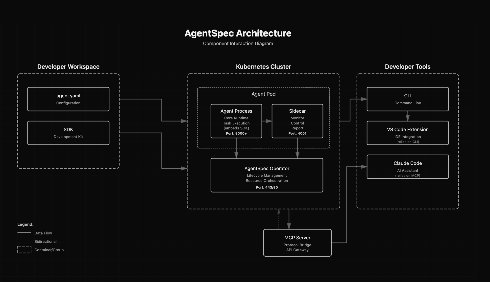

<p align="center">
  
</p>

[](https://www.npmjs.com/package/@agentspec/sdk)
[](https://github.com/agents-oss/agentspec/actions/workflows/ci.yml)
[](https://opensource.org/licenses/Apache-2.0)

**One `agent.yaml`. Validate, health-check, audit, and generate any AI agent.**

```bash
npm install -g @agentspec/cli
agentspec validate agent.yaml   # Schema validation
agentspec health agent.yaml     # Runtime health checks
agentspec audit agent.yaml      # Compliance scoring (OWASP LLM Top 10)
agentspec generate agent.yaml --framework langgraph
```

---

## What you can do

- [x] **Define** your agent in a single `agent.yaml` — model, tools, memory, guardrails, prompts
- [x] **Validate** schema with instant feedback and path-aware errors
- [x] **Health-check** all runtime dependencies (env vars, model API, Redis, Postgres, MCP servers)
- [x] **Audit** compliance against OWASP LLM Top 10, model resilience, and memory hygiene packs
- [x] **Generate** production-ready LangGraph, CrewAI, Mastra, or AutoGen code via Claude
- [x] **Scan** an existing codebase and auto-generate the manifest
- [x] **Evaluate** agent quality against JSONL datasets with CI pass/fail gates
- [x] **Deploy** to Kubernetes — operator injects sidecar, exposes `/health/ready` and `/gap`
- [x] **Export** to A2A / AgentCard format
- [ ] Visual dashboard for fleet-wide agent observability (coming soon)
- [ ] Native OpenTelemetry trace export (coming soon)

---

## How it Works



- **`agent.yaml`** is the single source of truth — the SDK reads it at runtime, the CLI validates and audits it, the operator deploys it
- **Sidecar** is injected automatically by the operator and exposes live `/health/ready`, `/gap`, and `/explore` endpoints without touching agent code
- **CLI** wraps the SDK for local development — validate, audit, generate, scan, evaluate
- **MCP Server** bridges the sidecar to Claude Code and VS Code for in-editor introspection

---

## Quick Start

```bash
# Install
npm install -g @agentspec/cli

# Create a manifest interactively
agentspec init

# Or scan an existing codebase
export ANTHROPIC_API_KEY=your-key
agentspec scan --dir ./src/

# Validate, health-check, audit
agentspec validate agent.yaml
agentspec health agent.yaml
agentspec audit agent.yaml

# Generate runnable code (requires ANTHROPIC_API_KEY)
agentspec generate agent.yaml --framework langgraph --output ./generated/
```

### Kubernetes

```bash
# One-line install
curl -fsSL https://raw.githubusercontent.com/agents-oss/agentspec/main/install.sh | bash

# Or with Helm
helm install agentspec-operator \
  oci://ghcr.io/agents-oss/charts/agentspec-operator \
  --version 0.1.1 \
  --namespace agentspec-system --create-namespace
```

### SDK (Node.js)

```bash
npm install @agentspec/sdk
```

---

## CLI Output

**Health check:**
```
  AgentSpec Health — budget-assistant
  ─────────────────────────────────────
  Status: ● healthy

  ENV
    ✓ env:GROQ_API_KEY
    ✓ env:DATABASE_URL
    ✓ env:REDIS_URL

  MODEL
    ✓ model:groq/llama-3.3-70b-versatile (94ms)
    ✓ model-fallback:azure/gpt-4 (112ms)

  MEMORY
    ✓ memory.shortTerm:redis (3ms)
    ✓ memory.longTerm:postgres (5ms)
```

**Compliance audit:**
```
  AgentSpec Audit — budget-assistant
  ────────────────────────────────────
  Score : B  82/100

  Category Scores
    owasp-llm-top10          75% ███████████████░░░░░
    model-resilience         100% ████████████████████
    memory-hygiene            80% ████████████████░░░░

  Violations (2)
    [high] SEC-LLM-10 — API keys use $secret, not $env
    [medium] MEM-04 — Vector store namespace isolated
```

---

## Manifest

```yaml
apiVersion: agentspec.io/v1
kind: AgentSpec

metadata:
  name: budget-assistant
  version: 1.0.0

spec:
  model:
    provider: openai
    id: gpt-4o-mini
    apiKey: $env:OPENAI_API_KEY
    fallback:
      provider: azure
      id: gpt-4
      apiKey: $env:AZURE_OPENAI_API_KEY

  prompts:
    system: $file:prompts/system.md

  tools:
    - name: get-balance
      type: function
      description: "Get account balance"
      module: $file:tools/finance.py

  guardrails:
    input:
      - type: prompt-injection
        action: reject

  compliance:
    packs:
      - owasp-llm-top10
      - model-resilience
```

See the [full manifest reference](https://agents-oss.github.io/agentspec/reference/manifest-schema) for all fields including memory, evaluation, MCP, subagents, and observability.

---

## Documentation

Full docs at **[agents-oss.github.io/agentspec](https://agents-oss.github.io/agentspec/)**

| | |
|---|---|
| [Quick Start](https://agents-oss.github.io/agentspec/quick-start) | Up and running in 5 minutes |
| [Manifest Concepts](https://agents-oss.github.io/agentspec/concepts/manifest) | All manifest fields explained |
| [Health Checks](https://agents-oss.github.io/agentspec/concepts/health-checks) | Runtime dependency checking |
| [Compliance & Audit](https://agents-oss.github.io/agentspec/concepts/compliance) | OWASP LLM Top 10 scoring |
| [CLI Reference](https://agents-oss.github.io/agentspec/reference/cli) | All commands and flags |

---

## Tech Stack

TypeScript · pnpm workspaces · Zod · js-yaml · commander · vitest · tsup · Python · Kopf · FastAPI · Fastify · Helm

---

## License

Apache 2.0

---

## Contributing

Issues and PRs welcome at [github.com/agents-oss/agentspec](https://github.com/agents-oss/agentspec).
