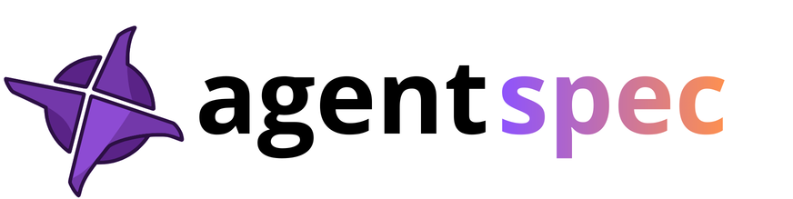

<p align="center">
  
</p>

[](https://www.npmjs.com/package/@agentspec/sdk)
[](https://github.com/agents-oss/agentspec/actions/workflows/ci.yml)
[](https://opensource.org/licenses/Apache-2.0)

**Universal Agent Manifest System** — define, validate, health-check, audit, and generate any AI agent from a single `agent.yaml` file.

```bash
agentspec validate agent.yaml  # Schema validation
agentspec health agent.yaml    # Runtime health checks
agentspec audit agent.yaml     # Compliance scoring (OWASP LLM Top 10)
agentspec generate agent.yaml --framework langgraph
```

---

## The Problem

AI agents are defined across scattered files: environment variables, prompt files, tool modules, and framework-specific configs. There is no portable way to:
- Know if all dependencies are present before starting (`health`)
- Check compliance with OWASP LLM Top 10 automatically (`audit`)
- Generate the same agent for a different framework (`generate`)
- Make agents discoverable and auditable without a control plane

## The Solution

One `agent.yaml` manifest captures everything:

```yaml
apiVersion: agentspec.io/v1
kind: AgentSpec

metadata:
  name: budget-assistant
  version: 1.0.0
  description: "Personal finance AI assistant"

spec:
  model:
    provider: groq
    id: llama-3.3-70b-versatile
    apiKey: $env:GROQ_API_KEY
    fallback:
      provider: azure
      id: gpt-4
      apiKey: $env:AZURE_OPENAI_API_KEY
      triggerOn: [rate_limit, timeout, error_5xx]
    costControls:
      maxMonthlyUSD: 200

  prompts:
    system: $file:prompts/system.md

  tools:
    - name: log-workout
      type: function
      description: "Log a completed training session"
      module: $file:tools/workouts.py
      function: log_workout

  memory:
    shortTerm:
      backend: redis
      connection: $env:REDIS_URL
      maxTokens: 8000
      ttlSeconds: 3600
    hygiene:
      piiScrubFields: [ssn, credit_card, bank_account]
      auditLog: true

  guardrails:
    input:
      - type: prompt-injection
        action: reject
    output:
      - type: toxicity-filter
        threshold: 0.7
        action: reject

  evaluation:
    framework: deepeval
    ciGate: true

  compliance:
    packs:
      - owasp-llm-top10
      - model-resilience
      - memory-hygiene
```

---

## Three Properties

| Property | Description |
|----------|-------------|
| **Zero control plane** | Just a file + SDK loaded locally. No server required. |
| **Extends existing standards** | MCP-compatible, AGENTS.md-compatible, A2A/AgentCard exportable. |
| **Framework-agnostic** | Generates LangGraph, CrewAI, Mastra, AutoGen code via adapters. |

---

## Install

### CLI

```bash
npm install -g @agentspec/cli
agentspec --help
```

### Kubernetes (Operator + Sidecar)

One-line install on any Kubernetes cluster:

```bash
curl -fsSL https://raw.githubusercontent.com/agents-oss/agentspec/main/install.sh | bash
```

Or with Helm directly:

```bash
helm install agentspec-operator \
  oci://ghcr.io/agents-oss/charts/agentspec-operator \
  --version 0.1.1 \
  --namespace agentspec-system --create-namespace
```

### SDK (Node.js)

```bash
npm install @agentspec/sdk
```

---

## Components

### `@agentspec/sdk` — Core SDK
The foundation. Loads and validates `agent.yaml`, runs runtime health checks, scores compliance against OWASP LLM Top 10, and exposes the adapter registry for code generation.

### `@agentspec/cli` — CLI
The `agentspec` command. Wraps the SDK with a terminal UI for `validate`, `health`, `audit`, `generate`, `init`, `scan`, `diff`, and `evaluate`.

### `@agentspec/adapter-claude` — Agentic Code Generator
Uses the Claude API to generate complete, runnable agent code from a manifest. Supports LangGraph, CrewAI, Mastra, and AutoGen. Requires `ANTHROPIC_API_KEY`.

### `agentspec-sidecar` — Kubernetes Sidecar
A Fastify proxy injected alongside agent pods by the operator. Exposes `/health/ready`, `/gap`, `/explore`, and `/audit` endpoints — live compliance and introspection without touching agent code. Docker image: `ghcr.io/agents-oss/agentspec-sidecar`.

### `agentspec-operator` — Kubernetes Operator
A Kopf-based Python operator that watches pods annotated with `agentspec.io/inject: "true"` and injects the sidecar automatically. Manages the `AgentObservation` CRD — visible in k9s as `:ao`. Docker image: `ghcr.io/agents-oss/agentspec-operator`.

### `agentspec-control-plane` — Control Plane
A FastAPI service that aggregates health and compliance data from all running agents. Provides a central dashboard and REST API for fleet-wide agent observability. Docker image: `ghcr.io/agents-oss/agentspec-control-plane`.

---

## Quick Start

```bash
# Install the CLI
npm install -g @agentspec/cli

# Create a new manifest interactively
agentspec init

# Validate schema
agentspec validate agent.yaml

# Check runtime dependencies
agentspec health agent.yaml

# Compliance audit (OWASP LLM Top 10)
agentspec audit agent.yaml

# Generate LangGraph code (requires ANTHROPIC_API_KEY)
agentspec generate agent.yaml --framework langgraph --output ./generated/
```

---

## Health Check Output

```
  AgentSpec Health — budget-assistant
  ─────────────────────────────────────
  Status: ● healthy

  ENV
    ✓ env:GROQ_API_KEY
    ✓ env:DATABASE_URL
    ✓ env:REDIS_URL

  MODEL
    ✓ model:groq/llama-3.3-70b-versatile (94ms)
    ✓ model-fallback:azure/gpt-4 (112ms)

  MEMORY
    ✓ memory.shortTerm:redis (3ms)
    ✓ memory.longTerm:postgres (5ms)
```

## Compliance Audit Output

```
  AgentSpec Audit — budget-assistant
  ────────────────────────────────────
  Score : B  82/100

  Category Scores
    owasp-llm-top10          75% ███████████████░░░░░
    model-resilience         100% ████████████████████
    memory-hygiene            80% ████████████████░░░░

  Violations (2)
    [high] SEC-LLM-10 — API keys use $secret, not $env
    [medium] MEM-04 — Vector store namespace isolated
```

---

## Extending AGENTS.md

```markdown
## Agent Manifest
This project uses [AgentSpec](https://agents-oss.github.io/agentspec/) for agent configuration.
See [agent.yaml](./agent.yaml) for the full manifest.

Run `agentspec health` to check runtime dependencies.
Run `agentspec audit` for compliance report.
```

---

## Reference Syntax

| Syntax | Resolves to |
|--------|-------------|
| `$env:VAR_NAME` | Environment variable |
| `$secret:name` | Secret manager (Vault/AWS/GCP/Azure) |
| `$file:path` | File relative to `agent.yaml` |
| `$func:now_iso` | Built-in function (timestamp, etc.) |

---

## Documentation

Full documentation at **[agents-oss.github.io/agentspec](https://agents-oss.github.io/agentspec/)**

- [Quick Start](https://agents-oss.github.io/agentspec/quick-start)
- [Manifest Concepts](https://agents-oss.github.io/agentspec/concepts/manifest)
- [Health Checks](https://agents-oss.github.io/agentspec/concepts/health-checks)
- [Compliance & Audit](https://agents-oss.github.io/agentspec/concepts/compliance)
- [CLI Reference](https://agents-oss.github.io/agentspec/reference/cli)

---

## Tech Stack

TypeScript · pnpm workspaces · Zod · js-yaml · commander · vitest · tsup · Python · Kopf · FastAPI · Fastify · Helm

---

## License

Apache 2.0
